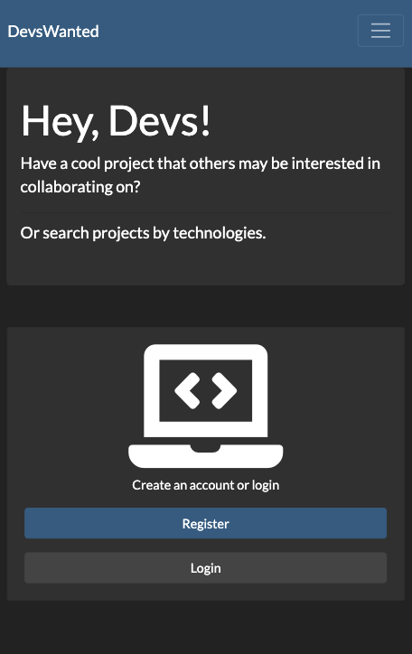
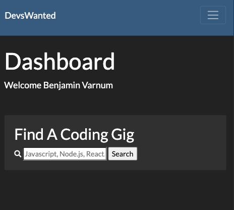
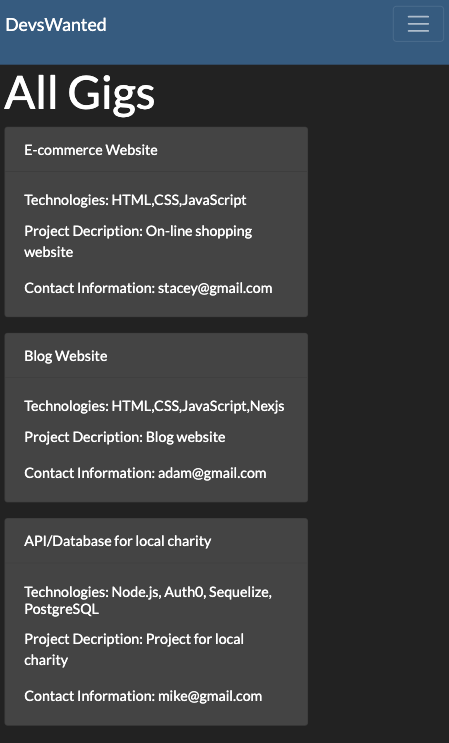
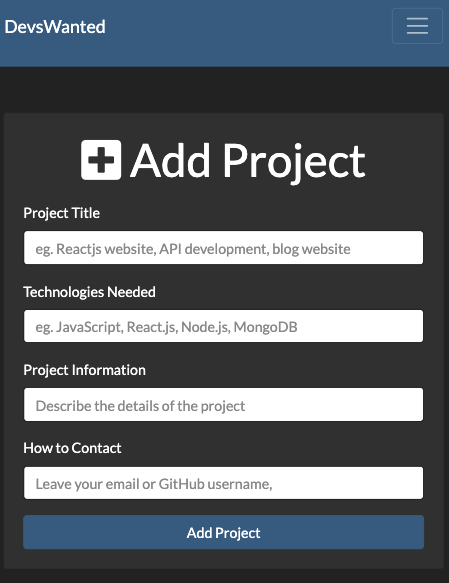

# DevsWanted

DevsWanted is a project posting app geared towards developers looking for projects to contribute to.

DevsWanted will be hosted and deployed by Heroku at (https://devswanted.herokuapp.com/)

---

## Running Jobbyist

1. Need to have [Node.js](https://nodejs.org/en/download/) installed.
1. Clone the repository.
1. Install node packages  
   `npm install`
1. Create a `.env` file in the root of the project and place the following variables in this file.

   1. LOCAL_USER= `your database user`
   1. LOCAL_PASS= `your database user password`
   1. LOCAL_NAME= `your database name`
   1. LOCAL_HOST=localhost
   1. GITHUB_CLIENT_ID= `your github client ID`
   1. GITHUB_CLIENT_SECRET= `your github client secret`
   1. HOST_URL= `http://localhost:5000/auth/github/callback`

1. Start the server  
   `npm start`
1. App will run on at `http://localhost:5000`

## Technologies Used

---

Express.js, Passport.js(Local and Github Strategies), PostgreSQL, EJS, Node.js, Javascript, Sequelize-ORM
